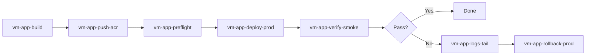

# VM Deployment — Automation Flow Naming & Engineer Playbook

Standalone guide for Docker Compose / ACR deployments on Azure VMs.  
Not tied to any single app — reuse the same flow names and checks across projects.

---

## 1. Automation flow naming convention

Use a **consistent, searchable** pattern so anyone can find the right pipeline in GitHub Actions, Azure DevOps, or internal scripts.

### Pattern

```
{target}-{app}-{action}-{env}
```

| Part | Meaning | Examples |
|------|---------|----------|
| `target` | Where it runs | `vm`, `aks`, `local` |
| `app` | Short app slug | `retailhub`, `paymentify`, `order-catalog` |
| `action` | What it does | `build`, `push`, `deploy`, `verify`, `rollback`, `otel-check` |
| `env` | Stage | `dev`, `staging`, `prod`, `demo` |

**Rules**

- Lowercase, hyphen-separated — no spaces or underscores.
- One flow = one job (don’t combine build + deploy + verify in one name).
- Keep `app` ≤ 20 chars.
- `env` is optional for shared flows (e.g. `vm-acr-login`).

### Recommended flow set (VM + Docker Compose)

| Flow name | Trigger | Purpose |
|-----------|---------|---------|
| `vm-{app}-build` | PR / manual | Build images locally or in CI |
| `vm-{app}-push-acr` | After build / tag | Push to `incidence.azurecr.io` |
| `vm-{app}-deploy-prod` | Manual / release tag | SSH → `docker compose pull && up -d` |
| `vm-{app}-verify-smoke` | After deploy | HTTP health + one business API |
| `vm-{app}-rollback-prod` | Manual | Pull previous tag, recreate containers |
| `vm-{app}-preflight` | Before deploy | NSG, disk, `.env` on VM, ACR login |
| `vm-{app}-logs-tail` | On failure | Fetch last N lines from gateway/web |
| `vm-{app}-otel-check` | After deploy | Confirm OTLP endpoint reachable from container |

### Examples

```
vm-retailhub-build
vm-retailhub-push-acr
vm-retailhub-deploy-prod
vm-retailhub-verify-smoke
vm-paymentify-deploy-prod
vm-paymentify-rollback-prod
```

### Folder / script layout (optional)

```
automation/
  vm/
    retailhub/
      build.sh
      push.sh
      deploy.sh
      verify.sh
      rollback.sh
    _shared/
      acr-login.sh
      ssh-run.sh
      smoke-http.sh
```

---

## 2. Standard automation flow (end-to-end)



### Stage checklist

**Build (`vm-*-build`)**

- [ ] Tag = semver or `{app}:1.0.0`
- [ ] UI: build-args from `.env` only at build time (Vite)
- [ ] Shared deps installed before service build (monorepo Dockerfiles)

**Push (`vm-*-push-acr`)**

- [ ] `az acr login --name incidence`
- [ ] Push all service images with same tag

**Preflight (`vm-*-preflight`)**

- [ ] VM SSH reachable
- [ ] Repo + compose file + per-service `.env` on VM
- [ ] NSG: app ports open (e.g. 3000, 6001, 6004)
- [ ] Cross-VM NSG if DB on another VM (3306, 5432, 27017, 6379)
- [ ] `docker compose config` validates

**Deploy (`vm-*-deploy-prod`)**

```bash
az acr login --name incidence
docker compose pull
docker compose up -d
docker compose ps
```

**Verify (`vm-*-verify-smoke`)**

- [ ] Gateway `/health` → 200
- [ ] One read API → 200 + JSON body
- [ ] UI loads (HTTP 200)
- [ ] Optional: headless browser or `curl` UI bundle for API URL

**Rollback (`vm-*-rollback-prod`)**

- [ ] Set `TAG=previous` in compose or env
- [ ] `pull` + `up -d` again
- [ ] Re-run smoke

---

## 3. Issues engineers hit most often (VM + Compose)

Use this as a triage table — **symptom → likely cause → quick check**.

| # | Symptom | Likely cause | Quick check |
|---|---------|--------------|-------------|
| 1 | `ImagePullBackOff` / pull denied | ACR not logged in on VM | `az acr login` then `docker pull ...` |
| 2 | Container exits immediately | Wrong env / missing `MYSQL_URL` | `docker compose logs <svc>` |
| 3 | `curl :6001` works, UI shows zeros | Browser JS error before request | DevTools Console + Network tab |
| 4 | Gateway logs empty, UI broken | Request never sent (frontend crash) | Reproduce in headless Chrome |
| 5 | Works on laptop, fails on VM | `.env` not copied to VM | `docker compose exec svc printenv` |
| 6 | Compose uses wrong DB URL | Central `.env.deploy` vs per-service `.env` | Prefer `env_file:` per service |
| 7 | Inter-service 502 | Gateway still points to `localhost` | Override URLs in compose `environment:` |
| 8 | DB connection timeout | NSG blocks VM → DB VM | `nc -zv <db-ip> 3306` from app VM |
| 9 | Redis/MySQL auth fail | Wrong password in `.env` | Connect manually from app VM |
| 10 | Old behavior after deploy | Stale image / no pull | `docker compose pull --ignore-pull-failures` |
| 11 | `host.docker.internal` fails (Linux) | Not in Docker Desktop | Add `extra_hosts: host-gateway` |
| 12 | OTEL traces missing | OTLP port blocked or wrong protocol | From container: reach `:4317` grpc |
| 13 | UI API URL wrong | Vite var baked at **build** time | Rebuild UI image after `.env` change |
| 14 | CORS errors (rare if gateway has `cors()`) | Custom headers + no preflight | OPTIONS request with Origin header |
| 15 | Healthcheck loop | DB slow start | Increase `start_period` / `retries` |
| 16 | Volume permission errors | PG/Mongo data dir | Check volume mount + user |
| 17 | Port already in use | Old container / systemd | `ss -tlnp \| grep <port>` |
| 18 | 3-VM split confusion | Compose on apps VM only | Infra compose on DB VMs separately |

---

## 4. Debug order (don’t skip steps)

When “UI not connecting to backend”:

1. **Backend direct** — `curl http://<vm-ip>:<gateway-port>/health`
2. **Business API** — `curl .../api/v1/...` (same as UI calls)
3. **Container env** — `docker compose exec gateway printenv`
4. **Gateway logs** — `docker compose logs gateway -f` while clicking UI
5. **Browser Network** — any `/api/` requests? status?
6. **Browser Console** — JS errors before network?
7. **Image age** — `docker inspect --format='{{.Created}}' <image>`

If step 1–2 pass but step 5 shows **no requests** → frontend bug, not infra.  
If step 5 shows requests but gateway logs empty → wrong host/port in UI bundle.

---

## 5. Secrets & env handling (team convention)

| Layer | Use for |
|-------|---------|
| Per-service `.env` in repo | Dev defaults; team maintains URLs |
| Compose `env_file:` | Runtime on VM — **don’t duplicate** secrets in compose |
| Compose `environment:` | Docker-only overrides (service DNS names, `PORT`) |
| CI secrets | ACR password, VM SSH key — never commit |
| Build-args | UI `VITE_*` only — baked into static JS |

**Do not** change microservice `.env` in automation — only compose/build wiring.

---

## 6. Minimal smoke script template

Save as `automation/vm/_shared/smoke-http.sh`:

```bash
#!/usr/bin/env bash
set -euo pipefail

BASE_URL="${1:?usage: smoke-http.sh http://host:port}"
curl -sf "${BASE_URL}/health" >/dev/null
curl -sf "${BASE_URL}/api/v1/..." | head -c 200
echo "smoke OK: ${BASE_URL}"
```

Wire into `vm-{app}-verify-smoke`.

---

## 7. What to automate first (priority)

| Priority | Flow | Why |
|----------|------|-----|
| P0 | `deploy` + `verify-smoke` | Cuts manual SSH mistakes |
| P1 | `preflight` | Catches NSG / missing `.env` before deploy |
| P2 | `build` + `push-acr` | Repeatable tags |
| P3 | `rollback` | Fast recovery |
| P4 | `otel-check` | Observability validation |

---

## 8. Naming anti-patterns (avoid)

| Bad | Why |
|-----|-----|
| `deploy.yml` | Which app? which env? |
| `prod_pipeline_final_v2` | Not searchable |
| `do-everything` | Can’t rerun verify alone |
| `test` | Meaningless in 6 months |

---

## 9. One-page cheat sheet

```text
NAME:  vm-{app}-{action}-{env}

FLOWS: build → push-acr → preflight → deploy → verify-smoke
       (fail) → logs-tail → rollback

VM:    az acr login && compose pull && compose up -d

DEBUG: curl gateway → curl API → compose logs → browser Network/Console

ENV:   env_file per service; compose overrides for Docker DNS only
UI:    rebuild image when VITE_* changes
OTEL:  host.docker.internal + extra_hosts on Linux
```

---

*Last updated: 2026-07-11 — generic VM playbook; adapt `{app}` per project.*
